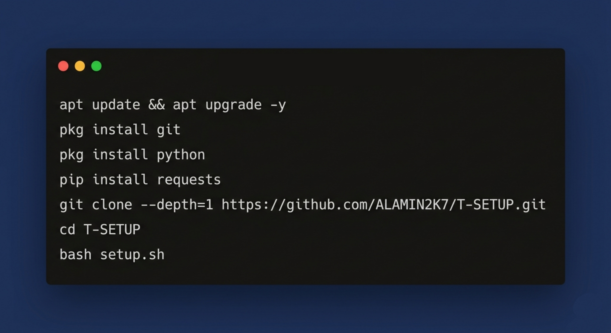
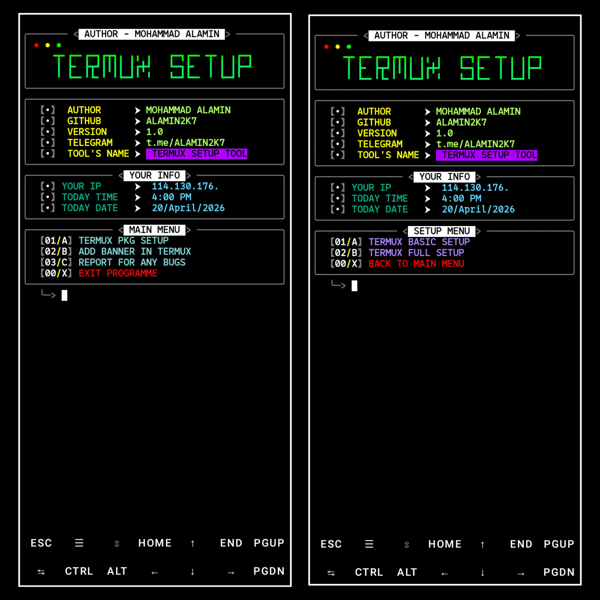
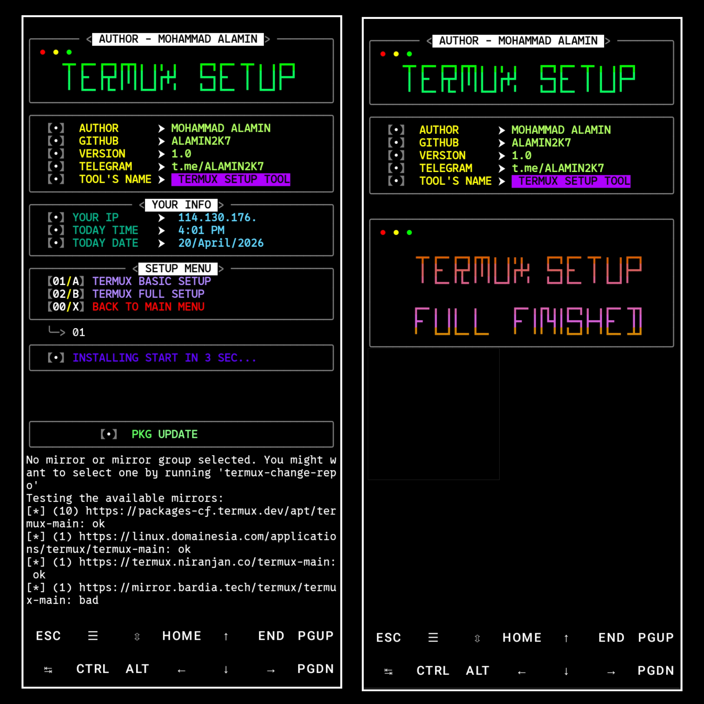

> Welcome to the **Termux Setup Tools**, a professional and user-friendly Bash script designed to optimize your Termux environment! This script installs essential packages, configures your terminal, tests internet speed, displays system information, and much more!  


</p>

## Tested On >

* TERMUX
## **📖 How It Works**  

1. **Check & Install Packages**:  
   - The script checks if each package is already installed.  
   - Installs only missing packages, skipping those already present.  

2. **Update & Upgrade**:  
   - Ensures your Termux environment is up-to-date.  

3. **Optimize Storage**:  
   - Removes unnecessary files and caches to reclaim space. 

## **🛡️ Requirements**  

- Termux environment.  
- Internet connection for downloading packages.  

## INSTALL  ON TERMUX
```python
apt update && apt upgrade -y
pkg install git
pkg install python
pip install requests
git clone --depth=1 https://github.com/ALAMIN2K7/T-SETUP.git
cd T-SETUP
bash setup.sh
```

<p align="center">

## Preview >

<p align="center">
<p align="center">

### Tools Languages :

<p align="center">
  
  
</p>


<br>

### Contributing
Feel Free To Clone This Project. For Major Changes, Please Open An Issue First To Discuss What You Would Like To Change Or Add, Thank You!!.

<h2 align="center">LICENSE</h2>

**T-SETUP** is released under the GNU General Public License v3.0, which grants the following permissions:
- Commercial use
- Distribution
- Patent use

## **❓ FAQ**  

### 1️⃣ What happens if a package is already installed?  
The script skips reinstallation and informs you with a message like:  
`Package xyz is already installed.`

For more convoluted language, see the [LICENSE](/LICENSE).
</br>
